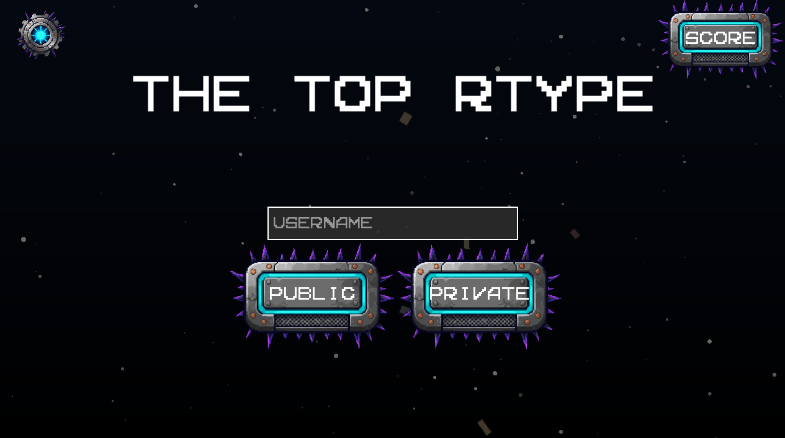
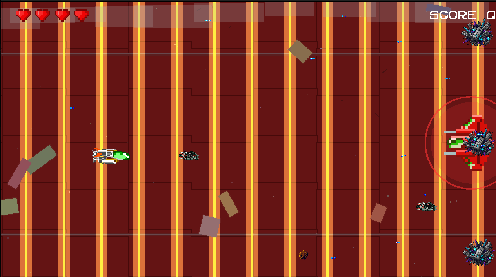
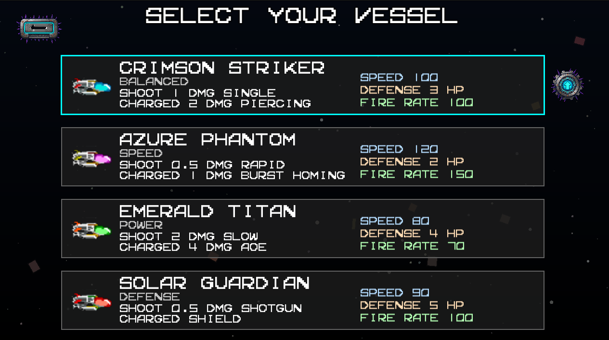
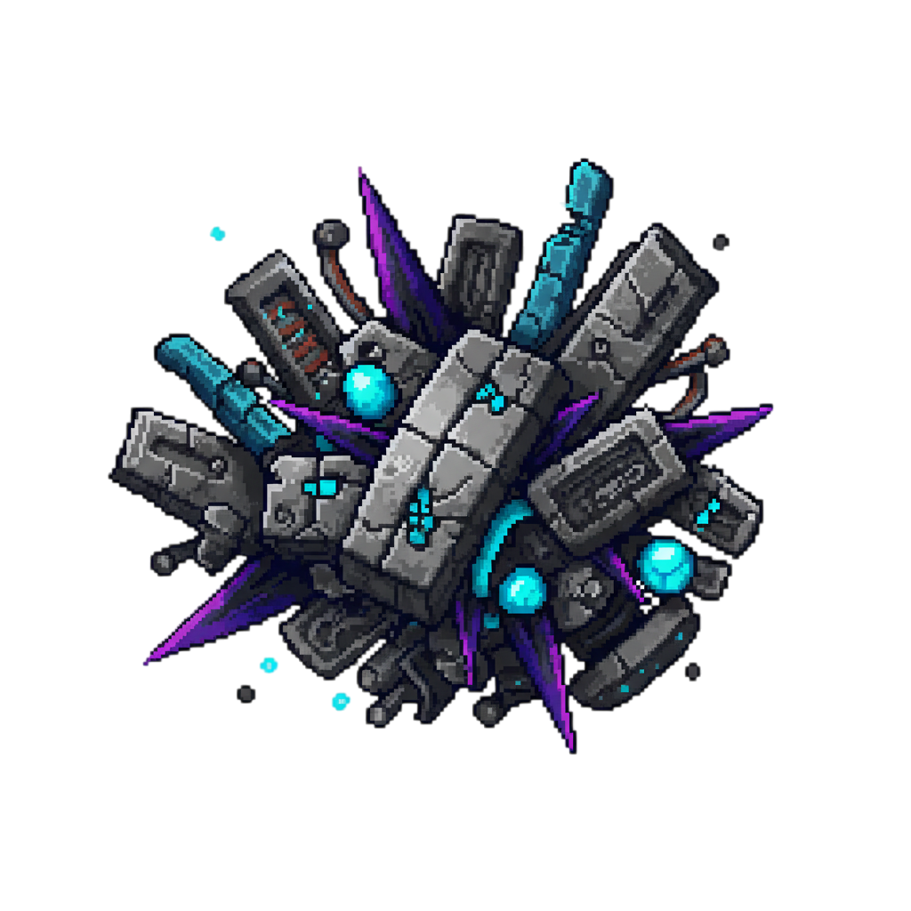

<div align="center">

# R-TYPE — Modern C++ Multiplayer Arcade Shooter

Fast-paced co-op arcade shooter, ECS-powered, with boss fights, forge augments, items, and buttery-smooth netcode.




</div>

## ✨ Highlights

- Four distinct vessels with unique weapons and charged shots
- Bosses per level with custom mechanics and arena phases
- Forge System: unlock a new fire pattern when you down a boss
- Obstacles and hazards that shake up the battlefield
- Online rooms and lobby flow; server-authoritative gameplay
- Clean ECS architecture shared by client and server



## 🎮 Gameplay Gallery

> Replace with real screenshots when available. For now, a peek at key in-game visuals and items.

<p>
	
	
	
	
</p>

Power-up items you’ll find while playing:

<p>
	
	
	
	
</p>

## 🛠️ Features (in a nutshell)

### Vessels and Weapons
- Crimson Striker — balanced blaster; charged shot pierces
- Azure Phantom — agile; charged shot fires homing darts
- Emerald Titan — heavy; explosive shots, shotgun-style augment
- Solar Guardian — defensive; Solar Pulse charged burst + tri-beam augment

All vessels support charged-fire. Cooldowns and damage scale per class.

### Forge System (Boss Rewards)
Defeat a boss to unlock a temporary augment that adds a second firing pattern on every shot:

- Dual Laser (Crimson Striker)
- Bouncy Split (Azure Phantom)
- Short Spread (Emerald Titan)
- Guardian Tri-Beam (Solar Guardian)

### Bosses and Hazards
- Multi-phase bosses with unique shields and attacks (e.g., RED shield mechanics)
- Meteorite obstacle (5 HP) — spawns on a timer, drifts and spins
- Debri obstacle (1000 HP) — spawns in 2–4 wide rows, slow push across screen

### Power-ups (100% drop rate per enemy, random pick)
- Shield — 3s invulnerability window
- Overdrive Core — +25% movement speed for 7s
- DMG Amplifier — +1 projectile damage for 8s
- Repair Kit — +1 HP (up to vessel max)

### Accessibility & Polish
- Parallax backgrounds and stage music per level
- Color-blind post-process shader (toggle in settings)
- Smooth animation, clean hit feedback, and HUD hearts

## ▶️ Build & Run

Requirements: CMake 3.20+, a C++20 compiler, SFML 2.5+.

Linux quick start:

```bash
mkdir -p build && cd build
cmake -DCMAKE_BUILD_TYPE=Release ..
cmake --build . -j

# In another terminal, start the server
./bin/server

# Then start the client
./bin/client
```

Run the client, enter your player name, pick a vessel, and either create a private room or join a public one.

## 🎮 Controls (default)

- Move — Arrow Keys / WASD
- Shoot — Space / Left Click
- Charged Shot — Hold Shoot, release to fire
- Pause/Menu — Esc
- Admin-only (private room owner) — B to spawn a boss (debug)

## 🧱 Project Structure

- `client/` — Rendering, input, HUD, prediction
- `server/` — Room, spawns, authoritative state, collisions
- `common/` — ECS components and shared systems (movement, shields, etc.)
- `lib/` — ECS, packet handler, map parser libraries
- `assets/` — Sprites, audio, maps, shaders
- `docs/` — Protocol, standards, benchmark notes

## 🧪 Dev Tips

- Build type: use `-DCMAKE_BUILD_TYPE=RelWithDebInfo` for better perf while debugging
- If sprites look huge or tiny, check `Sprite` scaling in factories under `client/src/gui/`
- Network issues? Verify UDP port 4242 and your firewall rules

---

## Developer Docs
- 🤝 [**Contributing Guide**](./CONTRIBUTING.md) - **Start here!** Complete guide for contributors
- [Code of Conduct](./docs/CODE_OF_CONDUCT.md)
- [Git Standards](./docs/GIT_STANDARD.md)
- [Coding Style Guidelines](./docs/CODING_STYLE.md)
- [Organisation Rules](./docs/ORGANISATION.md)
- [Maps Standard](./docs/MAPS_STANDARD.md)
- [Schéma UML](./archi_mindmap/README.md)