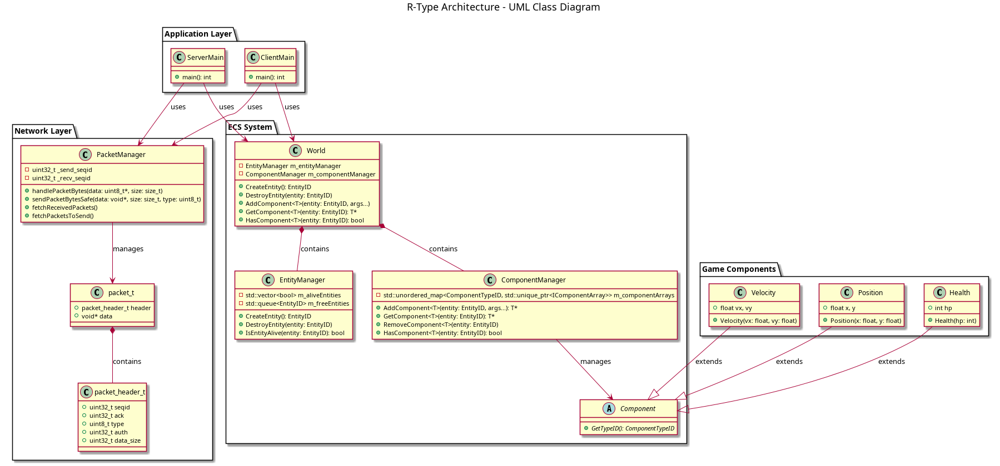
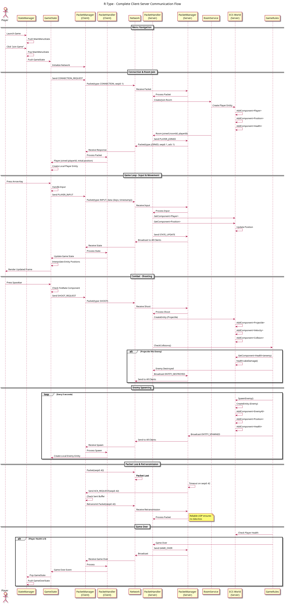
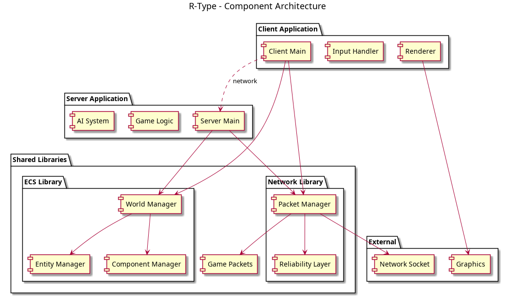

# R-Type - Schémas UML de l'Architecture

Ce répertoire contient la documentation UML complète du projet R-Type, incluant les diagrammes d'architecture et la documentation technique.

## 🎯 Vue d'ensemble du projet

R-Type est un jeu de type shoot'em up multijoueur implémenté en C++17 avec une architecture moderne basée sur :

- **ECS (Entity Component System)** pour la logique de jeu
- **PacketManager** pour la communication réseau fiable
- **Architecture Client-Serveur** pour le multijoueur
- **CMake** pour la gestion de build cross-platform

## 📊 Diagrammes UML Générés

### 1. Diagramme de Classes - Architecture (`architecture.png`)


**Description :** Vue complète de l'architecture montrant :
- **Network Layer** : PacketManager et structures de paquets
- **ECS System** : World, EntityManager, ComponentManager
- **Game Components** : Position, Velocity, Health
- **Application Layer** : Points d'entrée Client et Serveur

### 2. Diagramme de Séquence - Communication (`sequence.png`)


**Description :** Flux de communication client-serveur incluant :
- Initialisation de la connexion
- Traitement des entrées joueur
- Synchronisation d'état
- Gestion des paquets perdus avec retransmission

### 3. Régénérer Diagrammes
```bash
./generate_uml.sh
```


**Description :** Vue modulaire de l'architecture montrant :
- Applications (Client/Serveur)
- Bibliothèques partagées (ECS, Network)
- Dépendances externes
- Interfaces entre modules

## 🏗️ Architecture Détaillée

### Couche Réseau (Network Layer)
```cpp
class PacketManager {
    // Gestion fiable des paquets avec :
    // - Séquençage et détection de pertes
    // - Retransmission automatique
    // - Sérialisation/désérialisation
    void handlePacketBytes(const uint8_t* data, size_t size);
    std::unique_ptr<uint8_t[]> sendPacketBytesSafe(...);
}
```

### Système ECS (Entity Component System)
```cpp
class World {
    // Coordinateur principal :
    EntityID CreateEntity();
    template<typename T> T* AddComponent(EntityID entity, Args&&... args);
    template<typename T> T* GetComponent(EntityID entity);
}
```

### Communication Client-Serveur
```
Client Input → PacketManager → Network → PacketManager → Server
                                    ↓
Server Logic → ECS Processing → State Update → Clients
```

## 📁 Structure du Projet

```
rtype/
├── lib/                    # Bibliothèques partagées
│   ├── ecs/               # Système ECS
│   │   ├── include/ECS/   # Headers publics
│   │   └── src/           # Implémentations
│   └── packetmanager/     # Gestion réseau
│       ├── include/       # Headers
│       └── src/           # Implémentations
├── server/                # Application serveur
│   ├── main.cpp
│   └── CMakeLists.txt
├── client/                # Application client
│   ├── main.cpp
│   └── CMakeLists.txt
├── common/                # Structures partagées
│   └── packets/           # Définitions des paquets
├── tests/                 # Tests unitaires
│   ├── test_ecs.cpp
│   └── test_packetmanager.cpp
├── docs/                  # Documentation et diagrammes
│   ├── simple_architecture.png
│   ├── simple_sequence.png
│   ├── simple_components.png
│   └── README.md (ce fichier)
└── CMakeLists.txt         # Configuration principale
```

## 🔧 Génération des Diagrammes

### Prérequis
```bash
# Ubuntu/Debian
sudo apt-get install plantuml

# macOS
brew install plantuml
```

### Génération manuelle
```bash
# Générer tous les diagrammes
plantuml docs/architecture.puml
plantuml docs/sequence.puml
plantuml docs/components.puml

# Ou utiliser le script fourni
./generate_uml.sh
```

### Intégration VS Code
1. Installer l'extension "PlantUML"
2. Ouvrir un fichier `.puml`
3. `Ctrl+Shift+P` → "PlantUML: Preview Current Diagram"

## 🎮 Fonctionnalités Clés

### ECS (Entity Component System)
- **Performance** : Optimisé pour l'itération sur les composants
- **Flexibilité** : Ajout facile de nouveaux types de composants
- **Maintenabilité** : Séparation claire données/logique

### Communication Réseau Fiable
- **UDP + Fiabilité** : Rapide avec garantie de livraison
- **Séquençage** : Détection automatique des paquets perdus
- **Retransmission** : Renvoi automatique des paquets non reçus

### Architecture Modulaire
- **Bibliothèques indépendantes** : ECS et PacketManager réutilisables
- **Tests unitaires** : Couverture complète des fonctionnalités
- **Cross-platform** : Compatible Windows, macOS, Linux

## 🧪 Tests et Validation

```bash
# Compilation du projet
mkdir build && cd build
cmake .. -DCMAKE_BUILD_TYPE=Release
make

# Exécution des tests
ctest --verbose

# Tests spécifiques
./tests/test_ecs
./tests/test_packetmanager
```

## 📚 Avantages de cette Architecture

### 🚀 Performance
- Cache-friendly grâce à l'ECS
- Communication réseau optimisée
- Parallélisation possible des systèmes

### 🔧 Maintenabilité
- Séparation claire des responsabilités
- Modules indépendants et testables
- Code C++ moderne (smart pointers, RAII)

### 📈 Extensibilité
- Nouveaux composants sans modification de l'ECS
- Nouveaux types de paquets facilement ajoutés
- Architecture plugin-friendly

### 🛡️ Fiabilité
- Communication réseau robuste
- Tests unitaires complets
- Gestion d'erreurs appropriée

## 💡 Utilisation

### Côté Serveur
```cpp
ECS::World world;
auto player = world.CreateEntity();
world.AddComponent<Position>(player, 0.0f, 0.0f);
world.AddComponent<Health>(player, 100);

// Game loop avec traitement ECS et synchronisation réseau
```

### Côté Client
```cpp
ECS::World localWorld;
PacketManager networkManager;

// Gestion input + rendu + synchronisation avec serveur
```

Cette architecture fournit une base solide pour un jeu multijoueur performant, maintenable et extensible. Les diagrammes UML permettent de comprendre rapidement les interactions entre les différents modules et facilitent la maintenance du code.

---

**Note :** Les fichiers PlantUML source (`.puml`) sont également disponibles dans ce répertoire pour modification et régénération des diagrammes.