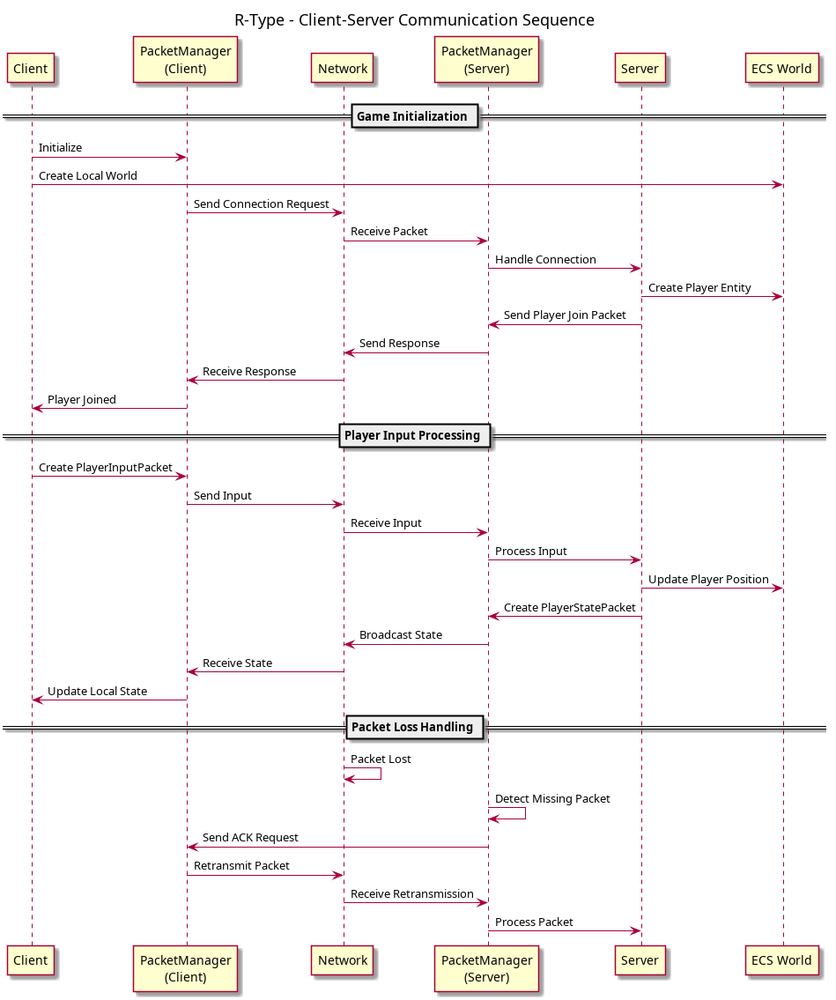

# R-Type - Documentation Architecture UML

> Documentation complete de l'architecture du projet R-Type avec diagrammes UML mis a jour

**Date**: Octobre 2025  
**Version**: 2.0 - Architecture Complete

---

## Table des Matieres

1. [Vue d'ensemble](#vue-densemble)
2. [Diagrammes UML](#diagrammes-uml)
3. [Structure du Projet](#structure-du-projet)
4. [Architecture Detaillee](#architecture-detaillee)
5. [Flux de Donnees](#flux-de-donnees)
6. [Utilisation](#utilisation)
7. [Regeneration des Diagrammes](#regeneration-des-diagrammes)

---

## Vue d'ensemble

**R-Type** est un jeu de type shoot'em up multijoueur inspire du classique arcade, implemente en C++17 avec une architecture moderne et scalable.

### Technologies Cles

- **C++17**: Standard moderne avec fonctionnalites avancees
- **ECS (Entity Component System)**: Architecture flexible pour la logique de jeu
- **SFML 2.5+**: Graphiques, audio, et reseau
- **CMake 3.20+**: Systeme de build cross-platform
- **PlantUML**: Generation de diagrammes UML
- **Reliable UDP**: Communication reseau optimisee avec garantie de livraison

### Principes Architecturaux

- **Separation des responsabilites**: Client (rendu, input) / Server (logique)
- **Code partage**: Composants communs entre client et serveur
- **Modularite**: Bibliotheques independantes et reutilisables
- **Extensibilite**: Facile d'ajouter de nouveaux composants et systemes
- **Performance**: ECS pour traitement efficace des entites

---

## Diagrammes UML

### 1. Diagramme de Classes - Architecture Complete


**Ce diagramme montre:**

#### Network Layer
- **PacketManager**: Gestion des paquets avec sequencage et retransmission
- **PacketHandler**: Systeme d'enregistrement et traitement des paquets
- **packet_t / packet_header_t**: Structures de donnees reseau

#### ECS Core
- **World**: Interface principale pour gerer entities et components
- **EntityManager**: Creation, destruction, et recyclage des entites
- **ComponentManager**: Stockage type-safe des composants

#### Common Components (Partages Client/Server)
- **Position, Velocity**: Transformation et mouvement
- **Health**: Points de vie avec damage/heal
- **Player**: Identification joueur (nom, serverId)
- **Projectile**: Projectiles avec proprietaire et degats
- **FireRate**: Cadence de tir avec cooldown
- **Collision**: Hitbox pour detection de collisions
- **Team, Score**: Systeme multijoueur et scoring

#### Client GUI System
- **StateManager**: Machine a etats pour les ecrans
- **States**: MainMenu, Game, Lobby, ServerSelection
- **Managers**: Texture, Music, Sound, Font
- **Systems**: Rendering, Parallax, Collision

#### Server Systems
- **RoomService**: Gestion des salles de jeu
- **PlayerService**: Gestion des joueurs connectes
- **GameRules**: Logique metier et regles du jeu
- **Systems**: EnemySpawner, Collision, Physics

#### Utilities
- **MapParser**: Chargement des niveaux (.map/.def)
- **EntityFactory**: Factory pour creer les entites
- **Logger, Config**: Logging et configuration

---

### 2. Diagramme de Sequence - Communication Client-Serveur



**Scenarios couverts:**

1. **Menu Navigation**: Navigation entre les etats du menu
2. **Connection & Room Join**: Connexion et creation/rejoindre une salle
3. **Game Loop**: Boucle de jeu complete (input → update → render)
4. **Combat**: Tir de projectiles avec detection de collision
5. **Enemy Spawning**: Generation automatique d'ennemis
6. **Packet Loss**: Gestion des paquets perdus avec retransmission
7. **Game Over**: Fin de partie et retour au menu

**Participants:**
- Player (acteur)
- StateManager, GameState
- PacketManager, PacketHandler (Client & Server)
- Network
- RoomService, PlayerService
- ECS World (Server)
- GameRules

**Flow de donnees typique:**
```
Player Input → GameState → PacketManager → Network
                                              ↓
Network → PacketManager → PacketHandler → Server
                                              ↓
Server → ECS World → GameRules → Update State
                                              ↓
PacketManager → Network → Client → Render
```

---

### 3. Diagramme de Composants - Architecture Modulaire


**Organisation des modules:**

#### Client Application (11 composants)
- Client Main, StateManager
- GameState, MainMenuState, Lobby States
- InputHandler, RenderSystem
- TextureCache, MusicManager, SoundManager
- FontManager, ParallaxSystem

#### Server Application (7 composants)
- Server Main
- RoomService, PlayerService
- GameRules, EnemySpawner
- CollisionSystem, PhysicsSystem

#### Common Components (10+ composants partages)
- Position, Velocity, Health
- Player, Projectile, FireRate
- Collision, Team, Score, EnemyType

#### Shared Libraries
- **ECS Library**: World, EntityManager, ComponentManager
- **Network Library**: PacketManager, PacketHandler, Reliability
- **Utilities**: MapParser, EntityFactory, Logger, Config

#### Assets
- Sprites (joueur, ennemis, projectiles, UI)
- Fonts (police personnalisee R-Type)
- Music (menu, level, boss, gameover)
- Sounds (tirs, explosions, degats)
- Maps (fichiers .map et .def)

#### External Dependencies
- SFML Graphics, Audio, Network
- Network Sockets
- Operating System

---

## Structure du Projet

```
rtype/
├── client/                     # Application Client
│   ├── components/            # Composants specifiques client
│   ├── include/
│   │   ├── gui/              # Systeme GUI (States, Managers)
│   │   ├── components/       # Animation, Audio, Camera, Input, Render
│   │   └── network/          # Controleurs reseau client
│   └── src/
│       ├── gui/              # Implementations GUI
│       └── network/          # Implementations reseau
│
├── server/                     # Application Serveur
│   ├── include/
│   │   ├── components/       # EnemyAI, PlayerConn, RoomProperties
│   │   ├── controllers/      # RoomController
│   │   ├── services/         # PlayerService, RoomService
│   │   └── systems/          # CollisionSystem, EnemySpawner, GameRules
│   └── src/
│       ├── controllers/      # Implementations controleurs
│       ├── services/         # Implementations services
│       └── systems/          # Implementations systemes
│
├── common/                     # Code partage Client/Server
│   ├── components/           # Position, Velocity, Health, Player, etc.
│   ├── core/                 # Entity, EntityType, Event, Hitbox
│   ├── network/              # MessageType, Packet, Protocol
│   ├── systems/              # ChargedShot, HealthSystem, MovementSystem
│   ├── utils/                # Config, EntityFactory, Logger, Random
│   └── packets/              # Definitions des paquets reseau
│
├── lib/                        # Bibliotheques partagees
│   ├── ecs/                  # Entity Component System
│   │   ├── include/ECS/      # World, EntityManager, ComponentManager
│   │   └── src/              # Implementations ECS
│   ├── packetmanager/        # Gestion reseau fiable
│   │   ├── include/          # PacketManager, packet_t
│   │   └── src/              # Implementations
│   ├── packethandler/        # Gestionnaire de paquets
│   │   ├── include/          # PacketHandler
│   │   └── src/              # Implementations
│   └── mapparser/            # Parser de niveaux
│       ├── include/          # MapParser
│       └── src/              # Implementations
│
├── assets/                     # Ressources du jeu
│   ├── sprites/              # Images (joueur, ennemis, projectiles)
│   ├── fonts/                # Polices personnalisees
│   ├── audio/
│   │   ├── music/           # Musiques de fond
│   │   ├── player/          # Sons du joueur
│   │   ├── enemy/           # Sons des ennemis
│   │   └── particles/       # Sons des effets
│   └── maps/                 # Niveaux du jeu (.map et .def)
│
├── tests/                      # Tests unitaires
│   ├── test_ecs.cpp          # Tests ECS
│   ├── test_mapparser.cpp    # Tests MapParser
│   └── packetmanager/        # Tests PacketManager
│
├── docs/                       # Documentation
│   ├── CODING_STYLE.md       # Standards de code
│   ├── GIT_STANDARD.md       # Conventions Git
│   ├── MAPS_STANDARD.md      # Format des maps
│   └── ORGANISATION.md       # Organisation du projet
│
├── archi_mindmap/             # Documentation UML (ce dossier)
│   ├── architecture.puml     # Source diagramme de classes
│   ├── sequence.puml         # Source diagramme de sequence
│   ├── components.puml       # Source diagramme de composants
│   ├── *.png                 # Diagrammes generes
│   └── README.md             # Ce fichier
│
├── scripts/                    # Scripts utilitaires
│   ├── generate_uml.sh       # Generation des diagrammes UML
│   └── font_to_sprites.py    # Conversion police vers sprites
│
├── examples/                   # Exemples de code
│   ├── mapparser_demo/       # Demonstration MapParser
│   └── packethandler_example.cpp
│
├── CMakeLists.txt             # Build principal
└── README.md                  # Documentation principale
```

---

## Architecture Detaillee

### Couche Reseau (Network Layer)

```cpp
class PacketManager {
    // Gestion fiable des paquets avec:
    // - Sequencage et detection de pertes
    // - Retransmission automatique
    // - Serialisation/deserialisation
    void handlePacketBytes(const uint8_t* data, size_t size);
    std::unique_ptr<uint8_t[]> sendPacketBytesSafe(...);
};

class PacketHandler {
    // Systeme d'enregistrement de handlers
    void registerHandler(uint8_t type, HandlerFunc handler);
    void processPacket(const packet_t& packet);
};
```

**Fonctionnalites:**
- Reliable UDP avec ACK et retransmission
- Sequencage des paquets (seqid)
- Detection de paquets perdus ou dupliques
- Handlers enregistrables par type de paquet

### Systeme ECS (Entity Component System)

```cpp
class World {
    // Coordinateur principal:
    EntityID CreateEntity();
    template<typename T> T* AddComponent(EntityID entity, Args&&... args);
    template<typename T> T* GetComponent(EntityID entity);
    void DestroyEntity(EntityID entity);
    std::vector<EntityID> GetAllEntities();
};
```

**Avantages de l'ECS:**
- **Performance**: Cache-friendly, iteration rapide
- **Flexibilite**: Composition plutot qu'heritage
- **Partage**: Meme systeme client/serveur
- **Extensibilite**: Ajout facile de nouveaux composants

### Systeme de GUI (Client)

```cpp
class StateManager {
    // Machine a etats pour les ecrans
    void pushState(std::unique_ptr<State> state);
    void popState();
    void update(float deltaTime);
    void render(sf::RenderWindow& window);
};

class GameState : public State {
    // Etat de jeu principal
    World world;
    Network network;
    TextureCache textures;
    MusicManager music;
};
```

**Etats disponibles:**
1. **MainMenuState**: Menu principal
2. **GameState**: Jeu actif
3. **PublicServerState**: Selection serveur public
4. **PrivateServerState**: Creation serveur prive
5. **PrivateServerLobbyState**: Lobby d'attente

### Services Serveur

```cpp
class RoomService {
    // Gestion des salles de jeu multijoueur
    RoomID createRoom();
    void joinRoom(RoomID roomId, PlayerID playerId);
    void leaveRoom(RoomID roomId, PlayerID playerId);
    World* getWorld(RoomID roomId);
};

class GameRules {
    // Regles du jeu et logique metier
    void checkCollisions(World& world);
    void spawnEnemies(World& world, float deltaTime);
    void updateScore(World& world);
};
```

### Systeme de Maps

**Format .def (Definition du niveau):**
```
name: "Level 1"
duration: 120
background: "space.png"
music: "level1.ogg"
```

**Format .map (Contenu du niveau):**
```
enemy:BasicEnemy:10:5:100:0
enemy:BossEnemy:120:10:500:0
powerup:Health:60:8:0:0
```

**Parsing avec MapParser:**
```cpp
MapParser parser;
MapData data = parser.parseMap("maps/level1.map");
parser.loadEntities(world, data);
```

---

## Flux de Donnees

### Connexion et Join Room

```
Client                          Server
  |                               |
  |--- CONNECTION_REQUEST ------->|
  |                               |
  |<---- PLAYER_JOINED -----------|
  |    (playerId, roomId)         |
  |                               |
  |--- READY --------------------->|
  |                               |
  |<---- GAME_START --------------|
```

### Boucle de Jeu

```
Client                          Server
  |                               |
  |--- INPUT (keys) -------------->|
  |                               |
  |                            Process Input
  |                            Update ECS
  |                            Check Collisions
  |                               |
  |<---- STATE_UPDATE ------------|
  |    (entities positions)       |
  |                               |
Interpolate                       |
Render                            |
```

### Combat

```
Client                          Server
  |                               |
  |--- SHOOT_REQUEST ------------->|
  |                               |
  |                          Check FireRate
  |                          Create Projectile
  |                          Check Collision
  |                               |
  |<---- ENTITY_SPAWNED ----------|
  |    (projectile data)          |
  |                               |
  |<---- ENTITY_DESTROYED --------|
  |    (enemy died)               |
  |                               |
  |<---- SCORE_UPDATE ------------|
```

---

## Utilisation

### Cote Client

```cpp
#include <ECS/ECS.h>
#include <gui/StateManager.h>
#include <gui/MainMenuState.h>

int main() {
    sf::RenderWindow window(sf::VideoMode(1920, 1080), "R-Type");
    StateManager stateManager;
    
    // Push menu principal
    stateManager.pushState(std::make_unique<MainMenuState>(stateManager));
    
    // Game loop
    sf::Clock clock;
    while (window.isOpen()) {
        float deltaTime = clock.restart().asSeconds();
        
        // Update et render de l'etat actuel
        stateManager.update(deltaTime);
        window.clear();
        stateManager.render(window);
        window.display();
    }
    
    return 0;
}
```

### Cote Serveur

```cpp
#include <ECS/ECS.h>
#include <services/RoomService.h>
#include <services/PlayerService.h>
#include <packetmanager.h>

int main() {
    // Services
    RoomService rooms;
    PlayerService players;
    PacketManager network;
    
    // Cree une room par defaut
    RoomID mainRoom = rooms.createRoom();
    World* world = rooms.getWorld(mainRoom);
    
    // Game loop
    while (running) {
        // Traite paquets reseau
        network.fetchReceivedPackets();
        
        // Update logique serveur
        GameRules::update(*world, deltaTime);
        
        // Envoie updates aux clients
        broadcastState(network, *world);
    }
    
    return 0;
}
```

### Creation d'Entites

```cpp
// Cote Client ET Serveur (code partage)
#include <common/utils/EntityFactory.h>
#include <common/components/Components.h>

// Creer un joueur
EntityID player = EntityFactory::createPlayer(world, 100.0f, 200.0f);

// Creer un ennemi
EntityID enemy = EntityFactory::createEnemy(world, 500.0f, 300.0f);

// Creer un projectile
EntityID projectile = EntityFactory::createProjectile(world, 150.0f, 210.0f);

// Acces aux composants
auto* pos = world.GetComponent<Position>(player);
auto* health = world.GetComponent<Health>(player);

// Modifier les composants
pos->x += 10.0f;
health->takeDamage(25);
```

---

## Regeneration des Diagrammes

### Script Automatique

```bash
# Depuis la racine du projet
./generate_uml.sh
```

**Le script:**
1. Verifie que PlantUML est installe
2. Nettoie les anciens PNG
3. Genere les nouveaux diagrammes
4. Affiche un resume

### Modification des Diagrammes

1. Editer les fichiers `.puml` dans `archi_mindmap/`
2. Regenerer avec le script
3. Verifier les PNG generes

### Installation PlantUML

```bash
# Ubuntu/Debian
sudo apt-get install plantuml

# macOS
brew install plantuml

# Windows
# Telecharger depuis https://plantuml.com/
```

---

## Composants Detailles

### Common Components

| Composant | Description | Utilisation |
|-----------|-------------|-------------|
| **Position** | Position 2D (x, y) | Toutes les entites visibles |
| **Velocity** | Velocite 2D (vx, vy) | Entites en mouvement |
| **Health** | Points de vie | Joueurs, ennemis |
| **Player** | Donnees joueur | Entites joueur |
| **Projectile** | Donnees projectile | Tirs |
| **FireRate** | Cadence de tir | Joueurs avec armes |
| **Collision** | Hitbox | Detection collisions |
| **Team** | Equipe | Multijoueur |
| **Score** | Points | Joueurs |
| **EnemyType** | Type d'ennemi | Ennemis |

### Client GUI Components

| Composant | Description | Role |
|-----------|-------------|------|
| **StateManager** | Gestionnaire d'etats | Machine a etats |
| **TextureCache** | Cache textures | Optimisation |
| **MusicManager** | Gestion musique | Audio background |
| **SoundManager** | Gestion sons | Effets sonores |
| **FontManager** | Gestion polices | Texte |
| **ParallaxSystem** | Fond parallaxe | Rendu fond |

### Server Services

| Service | Description | Responsabilite |
|---------|-------------|----------------|
| **RoomService** | Salles de jeu | Gestion rooms |
| **PlayerService** | Joueurs connectes | Gestion players |
| **GameRules** | Regles du jeu | Logique metier |

---

## Patterns de Conception

### Patterns Utilises

1. **Entity Component System (ECS)**: Architecture de jeu
2. **State Machine**: Gestion des ecrans (StateManager)
3. **Factory**: Creation d'entites (EntityFactory)
4. **Observer**: Evenements reseau (PacketHandler)
5. **Object Pool**: Recyclage d'entites (EntityManager)
6. **Singleton**: Managers globaux (MusicManager, etc.)
7. **Service Locator**: Acces aux services (RoomService, etc.)
8. **Cache**: Optimisation assets (TextureCache)

### Best Practices

- **Separation of Concerns**: Logique separee par modules
- **DRY (Don't Repeat Yourself)**: Code partage dans common/
- **SOLID Principles**: Design modulaire et extensible
- **Performance First**: Cache-friendly data structures
- **Type Safety**: Templates C++ pour ECS

---

## Reférences

### Documentation Interne
- [ECS Library README](../lib/ecs/README.md)
- [MapParser README](../lib/mapparser/README.md)
- [PacketHandler README](../lib/packethandler/README.md)
- [Coding Style](../docs/CODING_STYLE.md)
- [Git Standard](../docs/GIT_STANDARD.md)
- [Maps Standard](../docs/MAPS_STANDARD.md)
- [Organisation](../docs/ORGANISATION.md)

### Documentation Externe
- [PlantUML Documentation](https://plantuml.com/)
- [SFML Documentation](https://www.sfml-dev.org/documentation/)
- [CMake Documentation](https://cmake.org/documentation/)
- [C++17 Reference](https://en.cppreference.com/)

---

## Changelog

### Version 2.0 - Octobre 2025
- Mise a jour complete des diagrammes UML
- Ajout de 50+ nouvelles classes et composants
- Documentation du Client GUI System
- Documentation des Server Services
- Ajout du systeme de Maps
- Integration SFML Audio
- Systeme de States complet

### Version 1.0 - Septembre 2025
- Diagrammes UML initiaux
- Architecture ECS de base
- PacketManager de base
- Composants Position, Velocity, Health

---

**Auteurs**: R-Type Development Team  
**Derniere Mise a Jour**: 13 Octobre 2025  
**License**: Projet Educatif EPITECH
